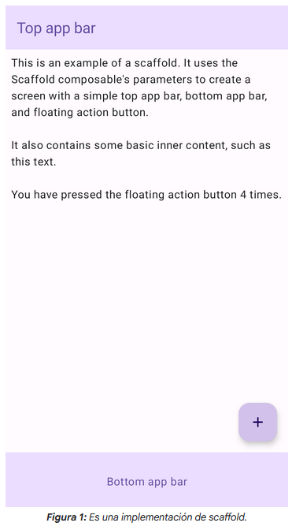

# Scaffold

> En Material Design, un **`scaffold`** es una estructura fundamental que proporciona una plataforma estandarizada para interfaces de usuario complejas. Une diferentes partes de la IU, como las barras de la app y los botones de acción flotantes, lo que les da a las apps un aspecto y un estilo coherentes.
### Ejemplo

- El elemento `Scaffold` componible proporciona una API sencilla que puedes usar para ensamblar rápidamente la estructura de tu app según los lineamientos de Material Design.
-  `Scaffold` acepta varios elementos componibles como parámetros. Entre ellas, se incluyen las siguientes:

     - `topBar`: Es la barra de la app que se encuentra en la parte superior de la pantalla.
    - `bottomBar`: Es la barra de la app que se encuentra en la parte inferior de la pantalla.
     - `floatingActionButton`: Es un botón que se desplaza sobre la esquina inferior derecha de la pantalla y que puedes usar para exponer acciones clave.

> **Nota:** Para obtener ejemplos más detallados sobre cómo implementar barras de la app tanto en la parte superior como en la inferior, consulta la página de barras de la app.

- También puedes pasar contenido de `Scaffold` como lo harías con otros contenedores. 
- Pasa `PaddingValues` a la lambda `content` que debes aplicar al elemento componible raíz de tu contenido para restringir su tamaño.

- En el siguiente ejemplo, se muestra una implementación completa de `Scaffold`. Contiene una barra de la app superior, una barra de la app inferior y un botón de acción flotante.

```kotlin
@Composable
fun ScaffoldExample() {
    var presses by remember { mutableIntStateOf(0) }

    Scaffold(
        topBar = {
            TopAppBar(
                colors = topAppBarColors(
                    containerColor = MaterialTheme.colorScheme.primaryContainer,
                    titleContentColor = MaterialTheme.colorScheme.primary,
                ),
                title = {
                    Text("Top app bar")
                }
            )
        },
        bottomBar = {
            BottomAppBar(
                containerColor = MaterialTheme.colorScheme.primaryContainer,
                contentColor = MaterialTheme.colorScheme.primary,
            ) {
                Text(
                    modifier = Modifier
                        .fillMaxWidth(),
                    textAlign = TextAlign.Center,
                    text = "Bottom app bar",
                )
            }
        },
        floatingActionButton = {
            FloatingActionButton(onClick = { presses++ }) {
                Icon(Icons.Default.Add, contentDescription = "Add")
            }
        }
    ) { innerPadding ->
        Column(
            modifier = Modifier
                .padding(innerPadding),
            verticalArrangement = Arrangement.spacedBy(16.dp),
        ) {
            Text(
                modifier = Modifier.padding(8.dp),
                text =
                """
                    This is an example of a scaffold. It uses the Scaffold composable's parameters to create a screen with a simple top app bar, bottom app bar, and floating action button.

                    It also contains some basic inner content, such as this text.

                    You have pressed the floating action button $presses times.
                """.trimIndent(),
            )
        }
    }
}
```

